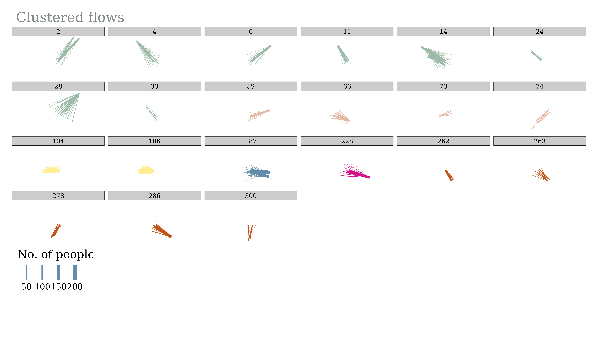

# flowcluster

<!-- badges: start -->

[](https://github.com/Hussein-Mahfouz/flowcluster/actions/workflows/R-CMD-check.yaml)
[](https://app.codecov.io/gh/Hussein-Mahfouz/flowcluster)
<!-- [](https://codecov.io/gh/Hussein-Mahfouz/flowcluster) -->

<!-- badges: end -->

The goal of flowcluster is to provide minimal functionality for
clustering origin-destination (OD) pairs, representing desire lines (or
flows). This includes:

1.  Creating distance matrices between OD pairs
2.  Passing distance matrices to a clustering algorithm

## Install from GitHub

You can install the development version of flowcluster from GitHub with:

``` r
# install.packages("devtools")
devtools::install_github("Hussein-Mahfouz/flowcluster")
```

Load it as follows:

``` r
library(flowcluster)
```

## Usage

The package provides a function to create a distance matrix from a data
frame of OD pairs, and then pass that matrix to a clustering algorithm.
The current distance matrix is an implementation of the flow distance
and flow dissimilarity measures described in (Tao and Thill 2016).

### Data preparation

First, load the flowcluster package and the sample data, and project it
to a
[projected](https://r.geocompx.org/spatial-class#projected-coordinate-reference-systems)
coordinate reference system (CRS).  
This is important for accurate length calculations and spatial
operations.

``` r
library(tidyverse)
library(sf)
library(tmap)

# Load sample flow data and project to metric CRS (e.g., EPSG:27700)
flows_sf <- flows_leeds
flows_sf <- st_transform(flows_sf, "EPSG:27700")
```

Next, add a column containing the length (in meters) of each flow
line.  
This step also checks that your data is in a projected CRS.

``` r
# Add length (meters) to each flow line
flows_sf <- add_flow_length(flows_sf)
head(flows_sf, 5)
```

    Simple feature collection with 5 features and 4 fields
    Geometry type: LINESTRING
    Dimension:     XY
    Bounding box:  xmin: 419427.1 ymin: 443211.1 xmax: 443015 ymax: 448448
    Projected CRS: OSGB36 / British National Grid
    # A tibble: 5 × 5
      origin    destination count                             geometry length_m
      <chr>     <chr>       <dbl>                     <LINESTRING [m]>    <dbl>
    1 E02002330 E02002330      30   (439593.3 448448, 439593.3 448448)       0 
    2 E02002330 E02002331     366   (439593.3 448448, 443015 447640.9)    3516.
    3 E02002330 E02002332       6 (439593.3 448448, 419427.1 446200.1)   20291.
    4 E02002330 E02002333       2 (439593.3 448448, 420574.6 444971.5)   19334.
    5 E02002330 E02002334      31 (439593.3 448448, 442341.2 443211.1)    5914.

Filter out flows based on a minimum and maximum length. In the code
below, we filter flows to keep only those between 1 and 20 kilometers.

``` r
# Filter flows based on length (e.g., between 100 and 10000 meters)
flows_sf <- filter_by_length(flows_sf, length_min = 1000, length_max = 20000)
```

Then, extract start and end coordinates for each flow, and assign unique
IDs.  
These are needed for subsequent distance calculations and clustering.

``` r
# Add start/end coordinates and unique flow IDs
flows_sf <- add_xyuv(flows_sf)
head(flows_sf, 5)
```

    Simple feature collection with 5 features and 9 fields
    Geometry type: LINESTRING
    Dimension:     XY
    Bounding box:  xmin: 420574.6 ymin: 443211.1 xmax: 443015 ymax: 448448
    Projected CRS: OSGB36 / British National Grid
    # A tibble: 5 × 10
      origin    destination count                    geometry length_m      x      y
      <chr>     <chr>       <dbl>            <LINESTRING [m]>    <dbl>  <dbl>  <dbl>
    1 E02002330 E02002331     366 (439593.3 448448, 443015 4…    3516. 4.40e5 4.48e5
    2 E02002330 E02002333       2 (439593.3 448448, 420574.6…   19334. 4.40e5 4.48e5
    3 E02002330 E02002334      31 (439593.3 448448, 442341.2…    5914. 4.40e5 4.48e5
    4 E02002330 E02002335      17 (439593.3 448448, 434926.1…    6385. 4.40e5 4.48e5
    5 E02002330 E02002336       5 (439593.3 448448, 424754.2…   15687. 4.40e5 4.48e5
    # ℹ 3 more variables: u <dbl>, v <dbl>, flow_ID <chr>

### Distance Matrix calculation

Calculate a pairwise distance measure between all flows using their
coordinates.  
You can adjust `alpha` and `beta` to change the relative importance of
start and end locations in the clustering process.

``` r
# Compute pairwise flow distances (fd and fds columns)
flows <- st_drop_geometry(flows_sf)
distances <- flow_distance(flows, alpha = 1, beta = 1)
```

Convert the long-format distance table to a matrix, which is required
for clustering.

``` r
# Create a distance matrix from the long-form distance data. Choose the column for distances you want to use.
# The 'fds' column is the flow dissimilarity measure, and the 'fd' column is the flow distance measure.
dmat <- distance_matrix(distances, distance_col = "fds")
# check 1st couple of rows columns of the distance matrix
head(dmat[1:2, 1:2])
```

                            E02002330_1-E02002331_2 E02002330_1-E02002333_4
    E02002330_1-E02002331_2                0.000000                2.741081
    E02002330_1-E02002333_4                2.741081                0.000000

### Clustering

Prepare a weight vector, typically based on a “count” column (number of
trips, etc).  
If your data does not have a “count” column, you can add one with
`flows$count <- 1`. Weights are very handy, otherwise our matrix would
be huge, as we would have to replicate each OD pair n times depending on
the number of observations between them. Unfortunately, there is no
out-of-the-box support for adding weights in other clustering algorithms
such as `hdbscan` or `optics`, so we will use
{[dbscan](https://github.com/mhahsler/dbscan)} for now, which does
support weights.

``` r
# Prepare weights for each flow (here we use the count column)
wvec <- weight_vector(dmat, flows, weight_col = "count")
```

Finally, cluster the flows using DBSCAN.  
Adjust `eps` and `minPts` to control cluster tightness and minimum
cluster size. Cluster composition is determined by these DBSCAN
parameters.

``` r
# Cluster flows using DBSCAN
flows_clustered <- cluster_flows_dbscan(dmat, wvec, flows, eps = 8, minPts = 70)

# View the first few rows of the clustered data
head(flows_clustered, 10)
```

    # A tibble: 10 × 10
       origin destination count length_m      x      y      u      v flow_ID cluster
       <chr>  <chr>       <dbl>    <dbl>  <dbl>  <dbl>  <dbl>  <dbl> <chr>     <int>
     1 E0200… E02002331     366    3516. 4.40e5 4.48e5 4.43e5 4.48e5 E02002…       1
     2 E0200… E02002333       2   19334. 4.40e5 4.48e5 4.21e5 4.45e5 E02002…       0
     3 E0200… E02002334      31    5914. 4.40e5 4.48e5 4.42e5 4.43e5 E02002…       0
     4 E0200… E02002335      17    6385. 4.40e5 4.48e5 4.35e5 4.44e5 E02002…       0
     5 E0200… E02002336       5   15687. 4.40e5 4.48e5 4.25e5 4.43e5 E02002…       0
     6 E0200… E02002341       9   12306. 4.40e5 4.48e5 4.29e5 4.42e5 E02002…       0
     7 E0200… E02002344       7   11883. 4.40e5 4.48e5 4.31e5 4.40e5 E02002…       0
     8 E0200… E02002345       1   14937. 4.40e5 4.48e5 4.27e5 4.40e5 E02002…       0
     9 E0200… E02002346       2   16966. 4.40e5 4.48e5 4.25e5 4.39e5 E02002…       0
    10 E0200… E02002347       3   13534. 4.40e5 4.48e5 4.30e5 4.39e5 E02002…       0

``` r
# how many unique clusters were found?
length(unique(flows_clustered$cluster))
```

    [1] 317

``` r
# number of flows in each cluster
flows_clustered |>
  group_by(cluster) |>
  summarise(n = n()) |>
  arrange(desc(n))
```

    # A tibble: 317 × 2
       cluster     n
         <int> <int>
     1       0  8652
     2      14   179
     3       4    62
     4     104    57
     5     187    56
     6      28    42
     7       2    35
     8      74    29
     9     228    29
    10       6    26
    # ℹ 307 more rows

### Visualise

Let’s take a look at the clusters

``` r
# Keep only the biggest clusters for visualisation
flows_clustered <- flows_clustered |>
  filter(cluster != 0) |> # these are normally the noisepoints
  group_by(cluster) |>
  mutate(
    size = n(),
    count_cluster = sum(count)
  ) |>
  ungroup() |>
  filter(
    size > 7, # minimum size of cluster
    count_cluster > 100
  ) # minumum number of trips in cluster
```

Add geometry back onto the data

``` r
# Add the geometry back onto the data
flows_clustered <- flows_sf |>
  select(flow_ID) |>
  inner_join(flows_clustered, by = "flow_ID")
```

``` r
# plot
tm_shape(flows_clustered) +
  tm_lines(
    lwd = "count",
    col = "cluster",
    palette = "Accent", # YlGn
    # style = "pretty",
    alpha = 1,
    title.col = "Cluster",
    title.lwd = "No. of people",
    scale = 10,
    legend.col.show = FALSE,
    showNA = FALSE
  ) +
  tm_facets(
    by = "cluster",
    free.coords = FALSE,
    nrow = 4,
    showNA = FALSE
  ) +
  tm_layout(
    fontfamily = "Georgia",
    main.title = paste0("Clustered flows"),
    main.title.size = 1.1,
    main.title.color = "azure4",
    main.title.position = "left",
    legend.outside = TRUE,
    legend.outside.position = "bottom",
    legend.stack = "horizontal",
    # remove panel headers
    # panel.show = FALSE,
    frame = FALSE
  ) -> cluster_results

cluster_results
```



The package also has a function to test different combinations of input
parameters (`eps` and `minPts`) to see how the clustering changes. This
can be useful for preliminary sensitivity analysis.

``` r
sensitivity_results <- dbscan_sensitivity(
  flows = flows,
  dist_mat = dmat,
  options_epsilon <- c(1, 2, 5, 7.5, 9),
  options_minpts <- c(50, 75, 100, 150)
)

# show the results
head(sensitivity_results)
```

    # A tibble: 6 × 4
      id              cluster  size count_sum
      <chr>             <int> <int>     <dbl>
    1 eps_1_minpts_50       0  9274     80815
    2 eps_1_minpts_50       1     1       366
    3 eps_1_minpts_50       2     1        71
    4 eps_1_minpts_50       3     1        61
    5 eps_1_minpts_50       4     1        82
    6 eps_1_minpts_50       5     1       342

``` r
# number of clusters with more than five od pairs:
sensitivity_results %>%
  filter(size > 5) %>%
  group_by(id) %>%
  summarise(
    no_of_clusters = n(),
    total_count = sum(count_sum)
  ) %>%
  ungroup() %>%
  arrange(desc(no_of_clusters))
```

    # A tibble: 20 × 3
       id                 no_of_clusters total_count
       <chr>                       <int>       <dbl>
     1 eps_7.5_minpts_50              47       82404
     2 eps_9_minpts_75                47       98085
     3 eps_9_minpts_50                46       85491
     4 eps_9_minpts_100               28      105479
     5 eps_7.5_minpts_75              26       94718
     6 eps_7.5_minpts_100             22      102502
     7 eps_9_minpts_150               18      113117
     8 eps_7.5_minpts_150             14      110810
     9 eps_5_minpts_50                 6       80175
    10 eps_5_minpts_75                 4       93612
    11 eps_5_minpts_100                3      102246
    12 eps_1_minpts_100                1      102797
    13 eps_1_minpts_150                1      111862
    14 eps_1_minpts_50                 1       80815
    15 eps_1_minpts_75                 1       94111
    16 eps_2_minpts_100                1      102797
    17 eps_2_minpts_150                1      111862
    18 eps_2_minpts_50                 1       80815
    19 eps_2_minpts_75                 1       94111
    20 eps_5_minpts_150                1      111443

Let’s plot the output

``` r
sensitivity_results %>%
  filter(cluster != 0) %>%
  group_by(id) %>%
  mutate(clusters = n()) %>%
  # How many clusters have more than 5 od pairs in them?
  mutate(clusters = sum(size > 5)) %>%
  ungroup() %>%
  filter(clusters > 5) %>%
  ggplot(aes(x = cluster, y = size, fill = count_sum)) +
  geom_col() +
  scale_y_continuous(trans = "log10") +
  facet_wrap(~id, scales = "fixed") +
  labs(
    title = "Sensitivity analysis for clustering - Varying {eps} and {minPts}",
    subtitle = "Parameter combinations that returned more than 1 cluster",
    x = "Cluster no.",
    y = "No. of od pairs in cluster",
    fill = "No. of \ncommuters"
  ) +
  theme_bw()
```


The plot shows the number of origin-destination pairs in each cluster.
For each facet, each bar represents a cluster, and the height of the bar
indicates the number of origin-destination pairs in that cluster. Many
of the parameter (`minPts` and `eps`) combinations returned no clusters,
and the combinations that did return clusters are shown in the plot.
Depending on the analysis being done, you could proceed with the
promising combinations, visualise them as done in the map above, and
choose the one that makes the most sense to you.

## Future Work

- [ ] Add more distance matrices (e.g. Frechet distance)
- [ ] Add more clustering algorithms, and use a more efficient data
  structure as a workaround for not being able to use weights with other
  clustering algorithms

## References

<div id="refs" class="references csl-bib-body hanging-indent"
entry-spacing="0">

<div id="ref-tao2016spatial" class="csl-entry">

Tao, Ran, and Jean-Claude Thill. 2016. “Spatial Cluster Detection in
Spatial Flow Data.” *Geographical Analysis* 48 (4): 355–72.
<https://doi.org/10.1111/gean.12100>.

</div>

</div>
